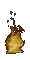

<!---
I am inside your walls
--->

 <strong>I Write Code Here</strong></strong> 

Electron and its consequences have been a disaster for the hardware race

 

<!-- 

 -->

<!--  -->

<!---
asimonson1125/asimonson1125 is a ✨ special ✨ repository because its `README.md` (this file) appears on your GitHub profile.
You can click the Preview link to take a look at your changes.
--->
